<div align="center">



</div>

<div align="center">

`robotics`&nbsp; · &nbsp;`machine learning`&nbsp; · &nbsp;`evaluation`

</div>

```
  I work on the failure side of learned systems: when a policy breaks,
  whether anything saw it coming, and how you prove the fix actually held.

  That runs from safety monitors under distribution shift, to routing
  perception compute by uncertainty, to the evaluation harnesses that
  keep either claim honest.
```

## RESEARCH

### [shift-safe-monitors](https://github.com/VihanAggarwal/shift-safe-monitors)

Safety monitors for learned robot policies under distribution shift. A benchmark
for the question that rarely gets answered cleanly: which monitor still works
once the deployment distribution moves.

`python`&nbsp; · &nbsp;`openvla`&nbsp; · &nbsp;`benchmark`

### [belief-space-perception-routing](https://github.com/VihanAggarwal/belief-space-perception-routing)

Routing perception compute by belief-state uncertainty instead of a fixed
schedule. Evaluated on TartanDrive with YOLO11 detectors across four tracks.

`python`&nbsp; · &nbsp;`perception`&nbsp; · &nbsp;`tartandrive`

### [rehab-cf-audit](https://github.com/VihanAggarwal/rehab-cf-audit)

Faithful counterfactual corrective feedback for skeleton-based rehabilitation
assessment, paired with a shortcut audit that asks what the quality scorer is
really keying on.

`pytorch`&nbsp; · &nbsp;`counterfactuals`&nbsp; · &nbsp;`pose`

## BUILDS

### [dualmind](https://github.com/VihanAggarwal/dualmind)

Prompt-injection defense for LLM email agents. Layered detection with a real
evaluation harness, benchmarked against LLMail-Inject rather than hand-picked
examples.

`python`&nbsp; · &nbsp;`llm-security`&nbsp; · &nbsp;`evaluation`

### [courtvision](https://github.com/VihanAggarwal/courtvision)

On-device AI referee, commentator, and scout for pickup basketball. One
smartphone, no extra hardware, offline-first.

`computer-vision`&nbsp; · &nbsp;`expo`&nbsp; · &nbsp;`fastapi`

### [fourtop](https://github.com/VihanAggarwal/fourtop)

Group restaurant decisioning, minus the group chat back and forth.

`typescript`&nbsp; · &nbsp;`react`

## STACK

```
  languages    Python  ·  TypeScript  ·  C#  ·  Java
  ml           PyTorch  ·  JAX / MJX  ·  Ultralytics  ·  scikit-learn
  robotics     MuJoCo  ·  ROS bags  ·  OpenVLA  ·  Isaac
  systems      FastAPI  ·  Next.js  ·  Postgres  ·  Vercel
```

<div align="center">

<sub>`·  ·  ·`</sub>

</div>
